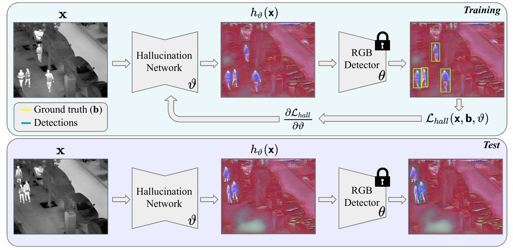

# [WACV2024] HalluciDet: Hallucinating RGB Modality for Person Detection Through Privileged Information

This repository contains the code used for [HalluciDet: Hallucinating RGB Modality for Person Detection Through Privileged Information 🔗](https://arxiv.org/abs/2310.04662) by Heitor Rapela Medeiros, Fidel A. Guerrero Pena, Masih Aminbeidokhti, Thomas Dubail, Eric Granger, Marco Pedersoli **(WACV 2024)**. 

Recently, this work was also accepted as an extended abstract in the [LatinX in CV (LXCV) @CVPR2024 🔗](https://www.latinxinai.org/cvpr-2024)

# Dependencies

	conda create -n hallucidet python=3.6
	conda activate hallucidet
	conda install pytorch torchvision torchaudio cpuonly -c pytorch
	pip install matplotlib
	pip install pytorch_lightning
	pip install opencv-python
	pip install imageio
	pip install scikit-image
	pip install scikit-learn
	pip install pandas
	pip install pycocotools
	pip install torchmetrics
	pip install wandb
	pip install lpips
	pip install segmentation-models-pytorch

# How to run

	## For training the initial rgb model that is the baseline
	## This is the seed123 result for the fasterrcnn on llvip dataset
	CUDA_VISIBLE_DEVICES=0 python train_detector.py --eval --pretrained --wandb-project wacv2024 --wandb-name detector_fasterrcnn_rgb_llvip_200ep_seed123 --detector fasterrcnn --modality rgb --dataset llvip --epochs 200 --batch 16 --seed 123

	## Train HalluciDet
	CUDA_VISIBLE_DEVICES=0 python train_hallucidet.py --eval --pretrained --modality ir --detector-path ./lightning_logs/wacv2024/detector_fasterrcnn_rgb_llvip_200ep_seed123/llvip_rgb_fasterrcnn/best.ckpt --wandb-project wacv2024 --wandb-name detector_fasterrcnn_hallucidet_det01reg01_llvip_200ep_seed123 --detector fasterrcnn --dataset llvip --epochs 200 --batch 8 --seed 123

  

# HalluciDet Qualitative Results

# Talks about this work

**WACV2024 Recorded Video**

**Talk at [LIVIA](https://liviamtl.ca/)**

# Cite our work

	@inproceedings{medeiros2024hallucidet,
	title={HalluciDet: Hallucinating RGB Modality for Person Detection Through Privileged Information},
	author={Medeiros, Heitor Rapela and Pena, Fidel A Guerrero and Aminbeidokhti, Masih and Dubail, Thomas and Granger, Eric and Pedersoli, Marco},
	booktitle={Proceedings of the IEEE/CVF Winter Conference on Applications of Computer Vision},
	pages={1444--1453},
	year={2024}
	}

# References

Really thanks for the great open source community that provided good libraries.